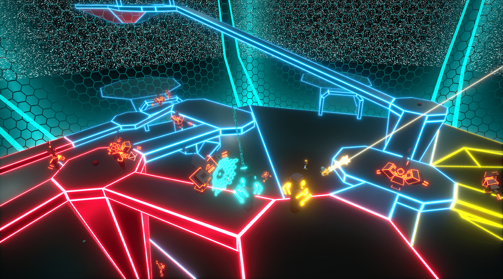
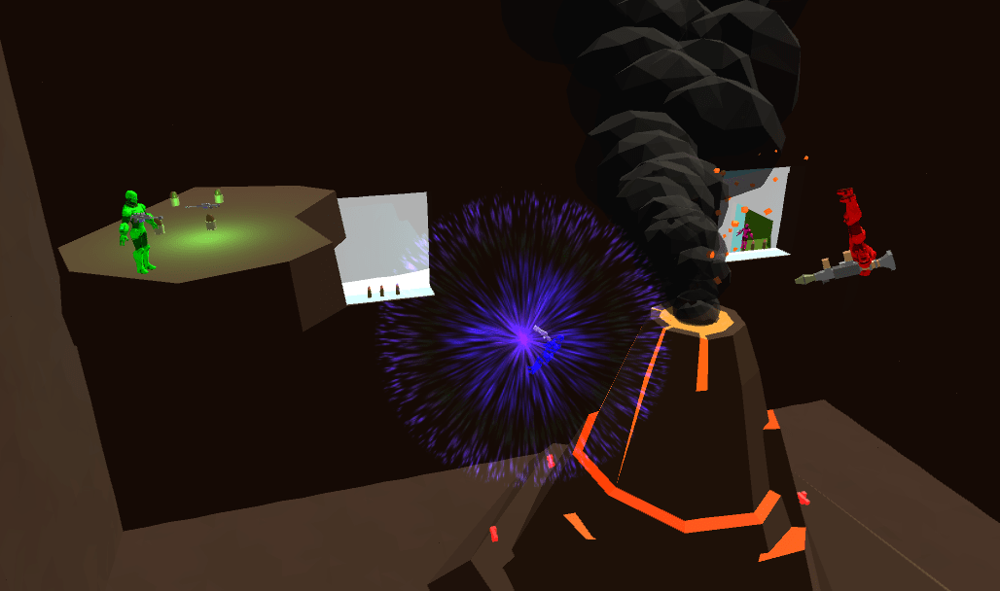
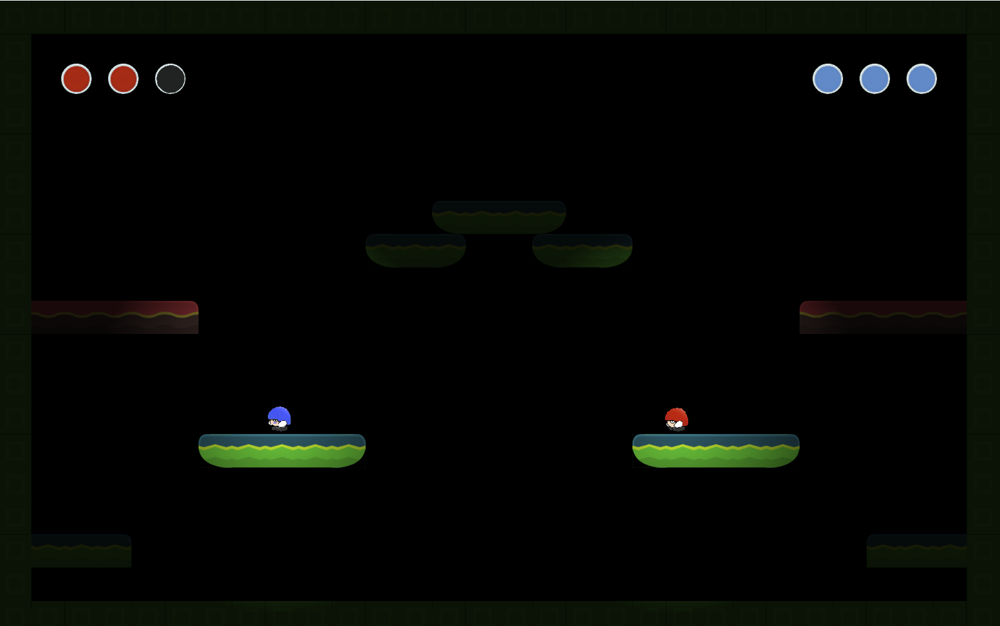
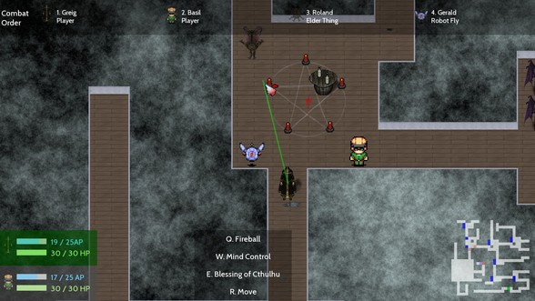
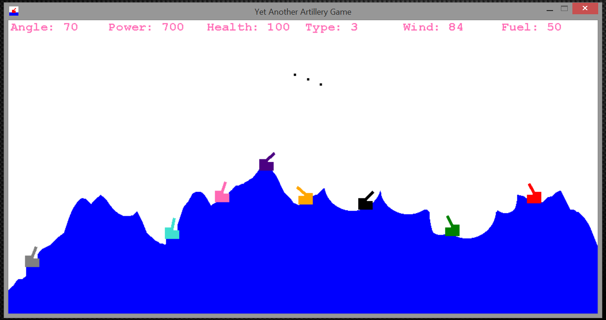
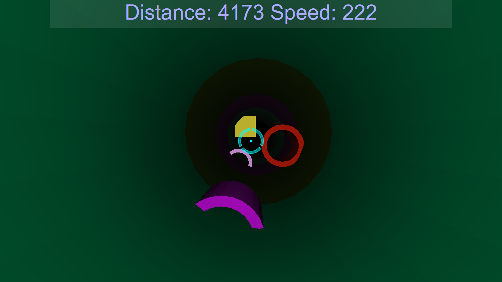

## Who is that guy?
I'm Lukas Rosenberger, a recent [MultiMediaTechnology](https://www.fh-salzburg.ac.at/en/study/design-media-and-arts/multimediatechnology-master) master's degree graduate majoring in Game and Simulation Engineering at [FH Salzburg](http://www.fh-salzburg.ac.at/). I'm passionate about AI programming and a huge fan of games of all kinds.

### Incendarius (2020)
Incendarius is a first person puzzle game with stealth and horror elements.
Experience the nightmares of Cayn, a troubled fire mage with a dark history.
Solve puzzles and hide from enemies, using the one thing you fear most (fire) to your advantage.

This is the final project of a team of students of MultiMediaTechnology (MMT) and MultiMediaArt (MMA) at University of Applied Sciences Salzburg (FHS).
I took the role of AI developer and Gameplay Programmer on the project. My responsibilities included:
* Creating intelligent AI-controlled enemies, including the final boss
* Closely working with artists to realize their designs in the game
* Supporting other programmers
* Creating, evolving and evaluating the game design

Incendarius was built using Unreal Engine 4 (UE4), using a combination of C++ and Blueprints.
You can check out our release on [itch.io](https://simonst0.itch.io/incendarius) or our [page in the MMT portfolio](https://portfolio.multimediatechnology.at/projects/2020-incendarius)!

### Major League Gladiators (2017)

<iframe width="560" height="315" src="https://www.youtube.com/embed/gjY6El749YM" title="YouTube video player" frameborder="0" allow="accelerometer; autoplay; clipboard-write; encrypted-media; gyroscope; picture-in-picture" allowfullscreen></iframe>

Major League Gladiators is a 2-player co-op shooter in VR. The players take control of two classes, the Tank and the DPS, facing off against waves of enemies in a tron-styled arena. Major League Gladiators attempts to use the immersive capabilities of Roomscale VR to create action packed combat as well as true cooperation between players. Players will have to attempt to survive as many waves of enemies as possible by synergistically using their abilities as well as keeping each other’s health and ammunition up. In Major League Gladiators we concentrate on the coop experience. We want the players to really play together. They attack together and they support each other. Lone wolves won’t survive!

This is the final project of my team of five bachelor degree students of MultiMediaTechnology (MMT) at University of Applied Sciences Salzburg (FHS). We also cooperated with students from MultiMediaArt (MMA) for our asset creation. The project started in January 2017 and was completed in June 2017.

I took the role of AI developer and Game Designer on the project. My responsibilities included:
*   Creating intelligent and extendable AI-controlled enemies
*   Closely working with artists to realize their designs in the game
*   Supporting other programmers
*   Creating, evolving and evaluating the game design

Major League Gladiators was built using Unreal Engine 4 (UE4) and supports all current headsets using SteamVR. Check out our [Steam Store page](https://store.steampowered.com/app/727310/Major_League_Gladiators/)!  

  
_A screenshot of Major League Gladiators_

### Gravity Ruckus (2016)
A four player, local multiplayer FPS where players can flip their gravity by 90° in any direction at any time. The game was built by two of my colleagues and me during our fourth bachelor semester using Unity. The full source can be found [here](https://github.com/in0x/Gravity_Ruckus).

  
_A screenshot of Gravity Ruckus_

### Helmet Squishers (2016)

Helmet Squishers is a 2D platform fighter for 2 players developed in 2 days for a Game Jam at the FH Salzburg under the motto 'It's not a bug, it's a feature'. The goal of the game is to squish your enemy three times by jumping on their head.

However, you can make your life easier or harder through activating one of the games modifiers:

*   Flip the games gravity by jumping on an activator pad.
*   Kick the enemy into a random direction, also via one of the activator pads.
*   Turn of your character light to sneak up to the enemy.

Everytime you jump there is also a chance of teleporting to a random position, which could work for (porting you away just before getting hit) or against (ruining your perfectly set up squish) you.

  
_A screenshot of Helmet Squishers_

[Download Link for Helmet Squishers on itch.io](https://in0x.itch.io/helmet-squishers)

### Reality Ruckus (2016)
As part of our MMP2a (MultiMediaProject) I and 2 of my fellow students developed a 2D tactical turn-based squad fighter called Realtity Ruckus.

In Reality Ruckus, you are a hero who has been chosen to restore order to time and space following a catastrophic event which collapsed multiple realites into each other. Along the way you will team up with other heroes to face the various different enemies.

You will have to explore randomly generated areas and face a multitude of foes in order to collect fragments of an artifact, which is the only hope to restore order back to space and time.

Upon finding all artifact fragments in an area, your hero will have to travel to the next dimension, where he will have to face new challenges.

  
_A screenshot of a combat in Reality Ruckus' Cthulhu setting_

[Project page for Reality Ruckus on the MMT/MMA portfolio (with download link!)](https://portfolio.multimediaart.at/projects/2016-reality-ruckus)

### Yet Another Artillery Game (2015)
This is the game I made for my second semester multi media project (MMP). It's a basic Scorched Earth clone with different weapons and up to 8 player hotseat multiplayer.

The goal is to shoot the other tanks, taking the ballistic trajectory of the projectiles and the wind into account. Using the limited movement and the destructible environment to your advantage will also ensure that you will be the last tank standing.

  
_A screenshot of Yet Another Artillery Game_

### [Accelerator](./accelerator) (2014)

(works best in Chrome)

This game was made during my first semester at FH. It's a clone of a flash game with the same name, the difference being that my version was made in JavaScript/WebGL with [three.js](https://github.com/mrdoob/three.js/).

In the game you fly through an endless tunnel, avoiding obstacles and flying through rings to gain speed boosts, all while you (and the background music) get continously faster.

  
_A screenshot of Accelerator_
